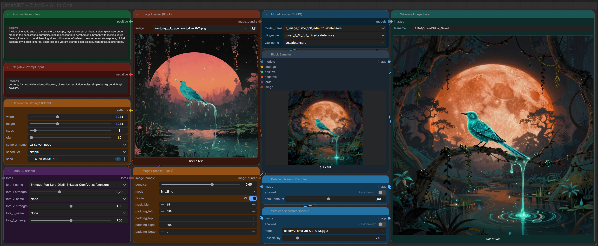

# 🌌 ComfyUI UmeAiRT Toolkit

[](https://gitlab.com/UmeAiRT-Studio/ComfyUI-UmeAiRT-Toolkit/-/pipelines)


[](https://registry.comfy.org/publishers/umeairt)

**A Block-Based, Pipeline-Driven Toolkit for ComfyUI.**

Stop fighting with "noodle soup"! The UmeAiRT Toolkit uses a **hub-and-spoke** architecture where typed bundles flow through a clean pipeline — from model loading to post-processing — with full interoperability with native ComfyUI nodes.



---

## ✨ Key Features

### 🧱 Block Architecture (Hub-and-Spoke)

- **Typed Bundles**: Loaders output `UME_BUNDLE` (model+clip+vae), settings output `UME_SETTINGS`, and the sampler creates a `UME_PIPELINE` that flows through the entire post-processing chain
- **GenerationContext**: A single `gen_pipe` object carries models, settings, prompts, and the generated image — no global state, no race conditions
- **Direct Prompting**: Connect `Positive/Negative` prompt editors directly to the Block Sampler

### 🔄 Full Interoperability (Pack/Unpack)

- **Pack Models Bundle**: Use any native or community loader → pack into `UME_BUNDLE` → feed the Block Sampler
- **Unpack Pipeline**: Extract IMAGE, MODEL, CLIP, VAE, prompts, settings from `UME_PIPELINE` → connect to any native node
- **Unpack Nodes**: Decompose any UME bundle type into standard ComfyUI types

### 🎛️ Advanced ControlNet Support

- **Auto-Download**: Missing `.safetensors` models are instantly downloaded from the UmeAiRT CDN via `aria2c`.
- **Union SDXL**: Native support for `controlnet-union-sdxl-1.0` with programmatic `control_type` injection.
- **Illustrious & Pony**: Seamless integration with Illustrious-XL ControlNet models (Canny, Depth, OpenPose) directly from the Block Sampler.

### 🎨 Custom Colors & UI

- **Automatic Connection Colors**: Custom colors for UME types are injected into any active ComfyUI theme
- **Intelligent Resizing**: Prompt nodes maintain readable sizes in Nodes 2.0
- **Color-Coded Categories**:
  - 🔵 **Blue**: Model Loaders
  - 🟢 **Green**: Prompts
  - 🟤 **Amber**: Settings & ControlNet
  - 🟣 **Violet**: LoRAs
  - ⬛ **Gray**: Sampler
  - 🔵 **Teal**: Post-Processing

---

### 📊 Built-In Hardware Monitor

- **Real-Time Monitoring**: CPU, RAM, GPU utilization, VRAM, and temperature directly in the ComfyUI top bar — no Crystools needed
- **Multi-Platform**: NVIDIA (pynvml), AMD ROCm, macOS Apple Silicon (MPS), and torch.cuda fallback
- **Multi-GPU Support**: Full support for RunPod and other multi-GPU setups
- **3 Switchable Styles**: Glassmorphism Pills, Accent Strip, or Micro Gauges (Settings → UmeAiRT → Monitor)
- **Contextual Progress Bar**: Shows `Generating 45%`, `Upscaling T2 30%`, `Detailing 80%` during pipeline execution
- **Peak VRAM Tracking**: Double-click VRAM to reset peak, rich tooltips on hover

---

## 📦 Nodes Overview

### Block Nodes (Core Pipeline)

| Category | Node | Description |
|:---|:---|:---|
| **Models** | `Model Loader` | Checkpoint loader → `UME_BUNDLE` |
| **Models** | `Model Loader - FLUX` | UNET + Dual CLIP + VAE → `UME_BUNDLE` |
| **Models** | `📦 Bundle Auto-Loader` | Select category + version, auto-download & load (aria2 accelerated) |
| **Settings** | `Generation Settings` | Width, Height, Steps, CFG, Seed → `UME_SETTINGS` |
| **Prompts** | `Positive / Negative Prompt Input` | Multiline text editors with dynamic prompts |
| **LoRA** | `LoRA 1x/3x/5x/10x` | Stackable LoRA loaders → `UME_LORA_STACK` |
| **Image** | `Image Loader` | Load and prepare source images → `UME_IMAGE` (bundle only) |
| **Image** | `Image Process` | All-in-one: set mode, denoise, resize, outpaint → `UME_IMAGE` |
| **Image** | `Image Process (Img2Img)` | Dedicated img2img: denoise + auto-resize → `UME_IMAGE` |
| **Image** | `Image Process (Inpaint)` | Dedicated inpaint: denoise + mask_blur → `UME_IMAGE` |
| **Image** | `Image Process (Outpaint)` | Target dimensions + alignment → `UME_IMAGE` (KSampler executes) |
| **Sampler** | `KSampler` | Central hub — receives all bundles, handles outpaint → `UME_PIPELINE` |

### Video Generation (LTX-2.3 + WAN)

| Category | Node | Description |
|:---|:---|:---|
| **Loaders** | `⬡ LTX Loader` | LTX-2.3 model + Gemma 3 dual CLIP + video/audio VAEs → `UME_BUNDLE` |
| **Settings** | `⬡ LTX Video Settings` | LTX-2.3 resolution (32px align), duration, fps, audio, ManualSigmas → `UME_VIDEO_SETTINGS` |
| **Generator** | `⬡ LTX Video Generator` | Dual-pass T2V + I2V pipeline with audio → `UME_VIDEO_PIPELINE` |
| **Extender** | `⬡ LTX Video Extender` | Extend video by generating new frames from reference context → `UME_VIDEO_PIPELINE` |
| **Enhancer** | `⬡ LTX Video Enhancer` | Upscale/enhance video with guided re-sampling (LoopingSampler) → `UME_VIDEO_PIPELINE` |
| **Keyframes** | `⬡ LTX Keyframe Generator` | Generate video from 2–3 keyframe images (start/mid/end) → `UME_VIDEO_PIPELINE` |
| **Director** | `⬡ Prompt Segment` | Chainable temporal prompt block → `UME_PROMPT_SCHEDULE` |
| **Director** | `⬡ LTX Prompt Director` | Per-segment prompt conditioning via LoopingSampler → `UME_VIDEO_PIPELINE` |
| **Audio** | `⬡ LTX Audio Replacer` | Replace or regenerate audio track → `UME_VIDEO_PIPELINE` |
| **Slicer** | `⬡ Video Slicer` | Trim video to time range (generic, WAN+LTX) → `UME_VIDEO_PIPELINE` |
| **Generator** | `⬡ Video Generator` | WAN 2.2 video T2V + I2V pipeline → `UME_VIDEO_PIPELINE` |
| **Output** | `⬡ Video Output` | Save video as MP4/WebM with optional audio muxing |

### Post-Processing (Pipeline-Aware)

| Node | Description |
|:---|:---|
| `UltimateSD Upscale` / `(Advanced)` | Tiled upscaling with pipeline context |
| `SeedVR2 Upscale` / `(Advanced)` | AI upscaler (bundled) |
| `FaceDetailer` / `(Advanced)` | Face enhancement with BBOX detection |
| `Detailer Daemon` / `(Advanced)` | Advanced detail enhancement |
| `Image Saver` | Save with metadata preservation |

### Pack/Unpack (Interoperability)

| Node | Direction | Description |
|:---|:---|:---|
| `Pack Models Bundle` | Native → UME | MODEL + CLIP + VAE → `UME_BUNDLE` |
| `Unpack Pipeline` | UME → Native | `UME_PIPELINE` → IMAGE + all 14 fields |
| `Unpack Models Bundle` | UME → Native | `UME_BUNDLE` → MODEL, CLIP, VAE |
| `Unpack Image Bundle` | UME → Native | `UME_IMAGE` → IMAGE, MASK, mode, denoise |
| `Unpack Settings` | UME → Native | Extract individual settings values |

### Utilities

| Node | Description |
|:---|:---|
| `💾 Bundle Model Downloader` | Download model bundles from HuggingFace (aria2 accelerated, no VRAM load — ideal for RunPod/cloud) |
| `📊 Hardware Monitor` | Built-in CPU/RAM/GPU/VRAM/Temp monitoring with 3 styles + contextual progress bar (Settings → UmeAiRT → Monitor) |
---

## 🚀 Installation

### Option A: ComfyUI Manager (Recommended)

1. Open **ComfyUI Manager**
2. Search for `UmeAiRT Toolkit`
3. Click **Install**

### Option B: Manual Installation

```bash
cd ComfyUI/custom_nodes
git clone https://gitlab.com/UmeAiRT-Studio/ComfyUI-UmeAiRT-Toolkit.git
pip install -r ComfyUI-UmeAiRT-Toolkit/requirements.txt
```

---

## 📜 Third-Party Code & Attribution

This toolkit bundles or adapts code from the following open-source projects. We are grateful to their authors.

| Component | Source | Author(s) | License |
|:---|:---|:---|:---|
| `seedvr2_core/vendor/` | [ComfyUI-SeedVR2_VideoUpscaler](https://github.com/numz/ComfyUI-SeedVR2_VideoUpscaler) | numz | Apache-2.0 |
| `usdu_core/` | [ComfyUI_UltimateSDUpscale](https://github.com/ssitu/ComfyUI_UltimateSDUpscale) | ssitu | GPL-3.0 |
| `image_saver_core/` | [ComfyUI-Image-Saver](https://github.com/alexopus/ComfyUI-Image-Saver) | alexopus | MIT |
| Detail Daemon logic | [sd-webui-detail-daemon](https://github.com/muerrilla/sd-webui-detail-daemon) | muerrilla | MIT |
| `facedetailer_core/` | Inspired by [ComfyUI-Impact-Pack](https://github.com/ltdrdata/ComfyUI-Impact-Pack) | ltdrdata | GPL-3.0 |
| `vendor/comfyui_gguf/` | [ComfyUI-GGUF](https://github.com/city96/ComfyUI-GGUF) | City96 | Apache-2.0 |
| LTX tiled decode (`ltx_utils.py`) | [ComfyUI-LTXVideo](https://github.com/Lightricks/ComfyUI-LTXVideo) | Lightricks Ltd. | Apache-2.0 |
| LTX samplers/latents (`vendor/ltxvideo/`) | [ComfyUI-LTXVideo](https://github.com/Lightricks/ComfyUI-LTXVideo) | Lightricks Ltd. | Apache-2.0 |
| `vendor/aria2/` | [aria2](https://github.com/aria2/aria2) | Tatsuhiro Tsujikawa | GPL-2.0 |

---

## ⚙️ Environment Variables

| Variable | Values | Default | Description |
|:---------|:-------|:--------|:------------|
| `HF_TOKEN` | any string | *(empty)* | HuggingFace authentication token for private/gated model downloads. Fallback: `~/.cache/huggingface/token` |
| `UMEAIRT_SKIP_HASH_CHECK` | `1`, `true`, `yes` | *(disabled)* | Skip SHA-256 hash verification after model downloads. **Recommended for cloud/container deployments** (RunPod, Vast.ai) where hashing multi-GB files on network storage is prohibitively slow |

---

## 🔒 Security

UmeAiRT Toolkit is audited for common vulnerabilities:

- **Path Traversal**: Patched in Image Saver with a `while` loop sanitizer + `os.path.abspath()` validation against the output directory
- **HTTP Timeouts**: All `urlopen` calls enforce `timeout=30/60` to prevent hanging on unresponsive servers
- **Token Safety**: HF tokens are read from environment/cache, never exposed in workflow JSON

---

## 🧪 Testing

300+ unit tests with GitLab CI on Python 3.10–3.14:

```bash
# Run all tests locally
python run_tests.py

# Run with coverage
coverage run --source=modules run_tests.py
coverage report -m --skip-covered
```

CI enforces a **40% coverage floor** (`--fail-under=40`).

New nodes should include structural tests — copy `tests/_template_node_test.py`.

---

## 📖 Documentation

Full documentation with node reference (I/O tables, usage tips) is available at:

🔗 **[toolkit.umeai.art](https://toolkit.umeai.art/)** (or [GitLab Pages](https://umeairt-studio.gitlab.io/ComfyUI-UmeAiRT-Toolkit/))

```bash
# Preview docs locally
pip install mkdocs-material
mkdocs serve  # → http://127.0.0.1:8000
```

---

## ❤️ Credits

Developed by **UmeAiRT**.  
License: MIT


---

<div align="center">

**Part of the [UmeAiRT Studio](https://gitlab.com/UmeAiRT-Studio) ecosystem**

[📡 CDN](https://get.umeai.art) · [⚙️ Installer](https://gitlab.com/UmeAiRT-Studio/ComfyUI-Auto_installer-Python) · [🧩 Toolkit](https://gitlab.com/UmeAiRT-Studio/ComfyUI-UmeAiRT-Toolkit) · [🔄 Sync](https://gitlab.com/UmeAiRT-Studio/ComfyUI-UmeAiRT-Sync) · [📚 Workflows](https://gitlab.com/UmeAiRT-Studio/ComfyUI-Workflows)

</div>
