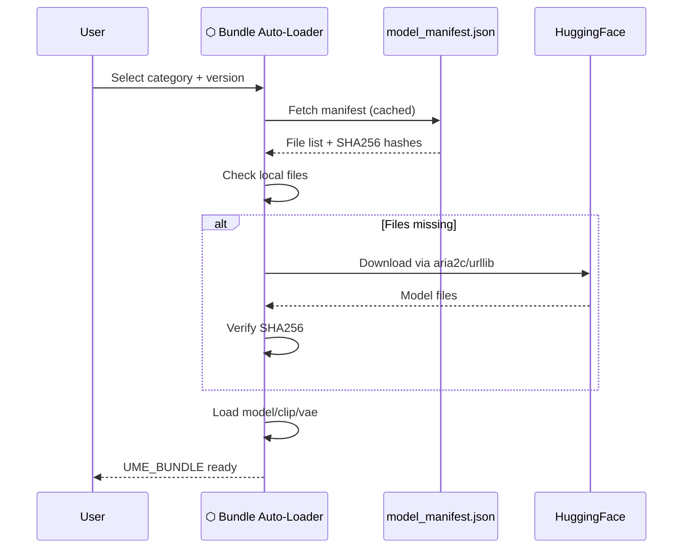

# Architecture

## Block Pipeline

The UmeAiRT Toolkit replaces ComfyUI's traditional spaghetti wiring with a **block architecture**. Instead of connecting individual model/clip/vae/conditioning wires, you pass typed bundles:

| Bundle Type | Contents | Created By |
|-------------|----------|------------|
| `UME_BUNDLE` | model + clip + vae + model_name (+ audio_vae, latent_upscale for LTX) | Loader nodes |
| `UME_SETTINGS` | width, height, steps, cfg, sampler, scheduler, seed | Generation Settings |
| `UME_VIDEO_SETTINGS` | width, height, duration, frame_rate, seed, audio_enabled, sigmas | Video Settings (LTX/WAN) |
| `UME_IMAGE` | image + mask + mode + denoise + controlnets | Image Loader/Process |
| `UME_LORA_STACK` | list of (name, model_strength, clip_strength[, target]) | LoRA Block / WAN LoRA Block nodes |
| `UME_PIPELINE` | Full generation context (all of the above + latent + result) | KSampler |
| `UME_VIDEO_PIPELINE` | Video generation context (frames + audio + metadata) | Video Generator |
| `UME_PROMPT_SCHEDULE` | List of temporal prompt segments [{start_time, prompt}] | Prompt Segment (chainable) |
| `UME_VACE_FRAMES` | VACE conditioning (start_image, end_image) | Video VACE Prep |
| `UME_FUNCONTROL` | FunControl conditioning (source_image, control_video, strength) | Video ControlNet Apply |

## Data Flow

```mermaid
graph TB
    subgraph "Loaders"
        CKP["⬡ Checkpoint Loader"]
        FLUX["⬡ FLUX Loader"]
        ZIMG["⬡ Z-IMG Loader"]
        LTX["⬡ LTX Loader"]
        BDL["⬡ Bundle Auto-Loader"]
    end

    subgraph "Inputs + Image"
        SET["⬡ Generation Settings"]
        POS["⬡ Positive Prompt"]
        NEG["⬡ Negative Prompt"]
        LORA["⬡ LoRA Block"]
        IMG["⬡ Image Loader"]
        IMGP["⬡ Image Process"]
        CNET["⬡ ControlNet Apply"]
        VACE["⬡ Video VACE Prep"]
    end

    subgraph "Sampler"
        KS["⬡ KSampler"]
    end

    subgraph "Post-Process"
        UP["⬡ UltimateSD Upscale"]
        SVR["⬡ SeedVR2 Upscale"]
        FD["⬡ Subject Detailer"]
    end

    subgraph "Output"
        SAV["⬡ Image Saver"]
    end

    CKP -->|UME_BUNDLE| KS
    FLUX -->|UME_BUNDLE| KS
    ZIMG -->|UME_BUNDLE| KS
    BDL -->|UME_BUNDLE| KS
    SET -->|UME_SETTINGS| KS

    LTX -->|UME_BUNDLE| VG["⬡ Video Generator"]
    LTXS["⬡ LTX Video Settings"] -->|UME_VIDEO_SETTINGS| VG
    VG -->|UME_VIDEO_PIPELINE| VEXT["⬡ Video Extender"]
    VG -->|UME_VIDEO_PIPELINE| LTXENH["⬡ LTX Video Enhancer"]
    VG -->|UME_VIDEO_PIPELINE| LTXAR["⬡ LTX Audio Replacer"]
    VG -->|UME_VIDEO_PIPELINE| VSLIC["⬡ Video Slicer"]
    VG -->|UME_VIDEO_PIPELINE| VOUT["⬡ Video Output"]

    WAN["⬡ WAN Loader"] -->|UME_BUNDLE| VG
    WANS["⬡ Video Settings"] -->|UME_VIDEO_SETTINGS| VG
    VACE -->|UME_VACE_FRAMES| VG
    VG -->|UME_VIDEO_PIPELINE| WLOOP["⬡ Video Looper"]
    VEXT -->|UME_VIDEO_PIPELINE| VOUT
    WLOOP -->|UME_VIDEO_PIPELINE| VOUT
    VCNET["⬡ Video ControlNet Apply"] -->|UME_FUNCONTROL| VG
    VEXT -->|UME_VIDEO_PIPELINE| VOUT
    LTXENH -->|UME_VIDEO_PIPELINE| VOUT
    LTXAR -->|UME_VIDEO_PIPELINE| VOUT
    VSLIC -->|UME_VIDEO_PIPELINE| VOUT

    PSEG1["⬡ Prompt Segment"] -->|UME_PROMPT_SCHEDULE| PSEG2["⬡ Prompt Segment"]
    PSEG2 -->|UME_PROMPT_SCHEDULE| LTXPD["⬡ LTX Prompt Director"]
    LTXPD -->|UME_VIDEO_PIPELINE| VOUT

    LTXKF["⬡ LTX Keyframe Generator"] -->|UME_VIDEO_PIPELINE| VOUT

    POS -->|POSITIVE| KS
    NEG -->|NEGATIVE| KS
    LORA -->|UME_LORA_STACK| KS
    IMG -->|UME_IMAGE| IMGP
    IMGP -->|UME_IMAGE| CNET
    CNET -->|UME_IMAGE| KS

    KS -->|UME_PIPELINE| UP
    KS -->|UME_PIPELINE| SVR
    KS -->|UME_PIPELINE| FD
    UP -->|UME_PIPELINE| FD
    SVR -->|UME_PIPELINE| FD

    KS -->|UME_PIPELINE| SAV
    UP -->|UME_PIPELINE| SAV
    FD -->|UME_PIPELINE| SAV
    SVR -->|UME_PIPELINE| SAV
```



## Module Structure

```
ComfyUI-UmeAiRT-Toolkit/
├── __init__.py              # Node registration (57 nodes)
├── modules/
│   ├── block_loaders.py     # Model loading nodes (Checkpoint, FLUX, Z-IMG, LTX, WAN, Bundle)
│   ├── video_sampler.py     # Unified Video Generator (orchestrator, dispatches wan/ltx)
│   ├── wan_sampler.py       # WAN video generation (T2V, I2V, VACE, FunControl, MoE)
│   ├── video_utils.py       # Shared video utilities (patch_wan_model, apply_color_match)
│   ├── video_vace_prep.py   # VACE Prep Node
│   ├── video_output.py      # Video Output with audio muxing
│   ├── video_postprod.py    # Video Frame Interpolation, Smart Upscale
│   ├── video_extender.py    # Unified Video Extender (orchestrator, dispatches wan/ltx)
│   ├── wan_extender.py      # WAN video extension (extend via VACE)
│   ├── video_looper.py      # WAN Video Looper (seamless loop via VACE)
│   ├── video_funcontrol.py  # Video ControlNet Apply (FunControl prep)
│   ├── video_lightning.py   # Video Lightning Accelerator
│   ├── video_optimization.py # Video Optimization (CFGZeroStar, EasyCache, NAG)
│   ├── ltx_sampler.py       # LTX-2.3 video generation (dual-pass, AV, ManualSigmas)
│   ├── ltx_extender.py      # LTX video extension (reference frames + AV latents)
│   ├── ltx_enhancer.py      # LTX Video Enhancer (LoopingSampler re-sampling)
│   ├── ltx_keyframe_generator.py  # LTX Keyframe Generator (2/3 keyframes)
│   ├── ltx_prompt_director.py     # Prompt Segment + Prompt Director (temporal scheduling)
│   ├── ltx_audio_replacer.py      # LTX Audio Replacer (replace/regenerate)
│   ├── ltx_utils.py         # LTX spatio-temporal tiled VAE decode (vendored)
│   ├── video_slicer.py      # Video Slicer (generic, WAN+LTX)
│   ├── logic_nodes.py       # Re-export shim (upscale_nodes, seedvr2_nodes, face_nodes, detail_daemon_nodes, detail_refiner)
│   ├── image_nodes.py       # Pipeline Image Saver
│   ├── utils_nodes.py       # Downloader, Pack/Unpack interop, Signature
│   ├── common.py            # Shared dataclasses and utilities
│   ├── manifest.py          # Model manifest parsing
│   ├── download_utils.py    # Download engine (aria2c + urllib)
│   ├── extra_samplers.py    # Custom sampler registration
│   └── optimization_utils.py # VRAM management, SageAttention
├── vendor/
│   └── ltxvideo/            # Vendored from ComfyUI-LTXVideo (Apache 2.0)
│       ├── easy_samplers.py # LTXVBaseSampler, ExtendSampler, InContextSampler
│       ├── looping_sampler.py # LTXVLoopingSampler (temporal tiling)
│       ├── latents.py       # Latent helpers (AddGuide, SelectLatents, etc.)
│       └── ...              # Guide, latent norm, IC-LoRA attention
├── web/                     # Frontend JS (widget extensions)
├── docs/                    # This documentation
└── tests/                   # Test suite (378+ tests)
```

## Bundle Auto-Download

The Bundle system uses a remote `model_manifest.json` hosted on [UmeAiRT Assets](https://huggingface.co/UmeAiRT/ComfyUI-Auto-Installer-Assets):


