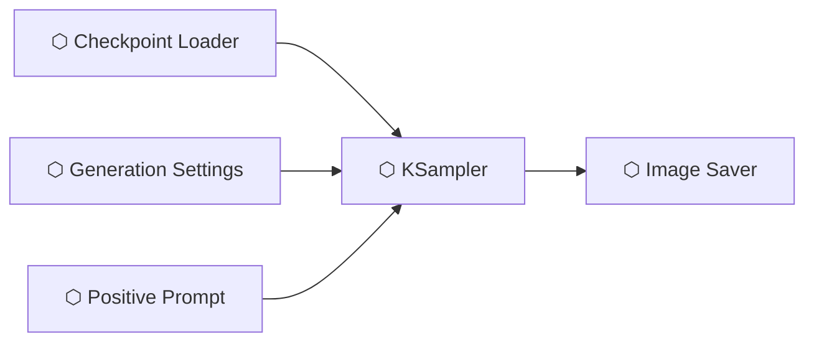

# Getting Started

## Installation

### Via ComfyUI Manager (Recommended)

1. Open ComfyUI
2. Open **Manager** → **Install Custom Nodes**
3. Search for **UmeAiRT Toolkit**
4. Click **Install** and restart ComfyUI

### Manual Installation

```bash
cd ComfyUI/custom_nodes
git clone https://gitlab.com/UmeAiRT-Studio/ComfyUI-UmeAiRT-Toolkit.git
pip install -r ComfyUI-UmeAiRT-Toolkit/requirements.txt
```

Restart ComfyUI after installation.

## Prerequisites

| Requirement | Details |
|-------------|---------|
| **ComfyUI** | Latest version |
| **Python** | 3.10 – 3.13 |
| **PyTorch** | With CUDA (NVIDIA), ROCm (AMD), or MPS (Apple Silicon) |
| **VRAM** | ≥6 GB recommended (4 GB minimum with GGUF Q4 models) |

!!! tip "Optional: aria2c for fast downloads"
    The Bundle Loader/Downloader uses `aria2c` for multi-connection downloads when available. Without it, downloads fall back to `urllib` (single-thread).

## Your First Workflow

The UmeAiRT Toolkit uses a **block architecture** where each node handles one concern:



1. Add a **⬡ Checkpoint Loader** → select your model
2. Add **⬡ Generation Settings** → set dimensions, steps, CFG, sampler
3. Add **⬡ Positive Prompt Input** → write your prompt
4. Add **⬡ KSampler** → connect all three inputs
5. Add **⬡ Image Saver** → connect the pipeline output

!!! note "Bundle System"
    For an even simpler setup, use the **⬡ Bundle Auto-Loader** which auto-downloads models. See [Bundle Auto-Loader](nodes/bundle-loader.md).

<!-- TODO: Screenshot — Minimal workflow (Loader + Settings + Prompt → Sampler → Saver) -->
<!-- PLACEHOLDER: Add a screenshot showing the 5-node minimal workflow described above -->
