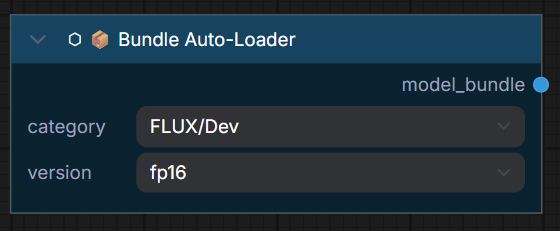

# ⬡ 📦 Bundle Auto-Loader

> Select a model family + version, auto-download missing files, and load them — all in one node.

## Inputs

| Name | Type | Required | Description |
|------|------|----------|-------------|
| `category` | `COMBO` | ✅ | Model family (e.g. `FLUX/Dev`, `Z-IMAGE/Turbo`, `SD15/Base`) |
| `version` | `COMBO` | ✅ | Quantization/precision variant (e.g. `fp16`, `GGUF_Q4`, `fp8_e4m3fn`) |

## Outputs

| Name | Type | Description |
|------|------|-------------|
| `model_bundle` | `UME_BUNDLE` | Complete bundle with model + clip + vae ready for KSampler |

## How It Works

1. **Reads** the remote `model_manifest.json` (cached locally after first fetch)
2. **Checks** which files are already present in your ComfyUI model folders
3. **Downloads** missing files via `aria2c` (multi-connection) or `urllib` (fallback)
4. **Verifies** SHA-256 integrity of downloaded files
5. **Loads** all components and returns a ready-to-use `UME_BUNDLE`

!!! warning "First-time download"
    Models are large files (4-24 GB). The first run on a new category/version will download everything. Subsequent runs skip already-present files.

!!! tip "HuggingFace token"
    For faster/authenticated downloads from HuggingFace, set the `HF_TOKEN` environment variable or add it to your HuggingFace CLI config.

!!! tip "Cloud / Container deployments"
    SHA-256 verification can be very slow on network storage (RunPod, Vast.ai, etc.). Set `UMEAIRT_SKIP_HASH_CHECK=1` in your entrypoint to bypass it. A yellow log message will confirm the skip.

