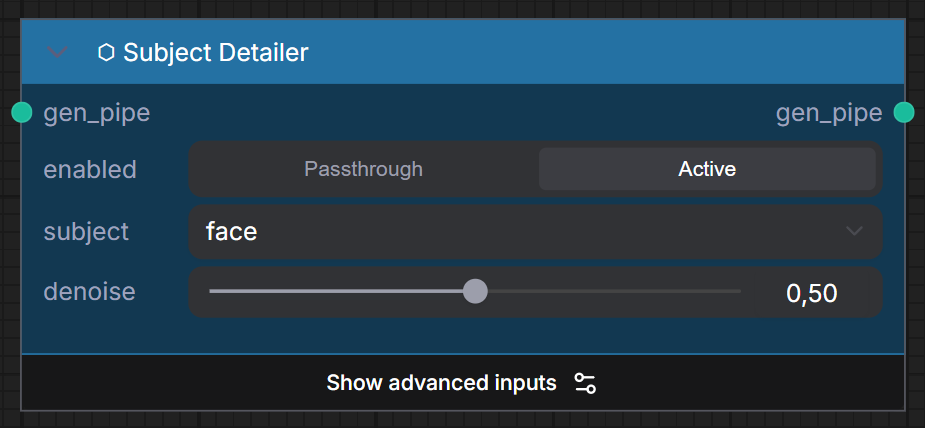
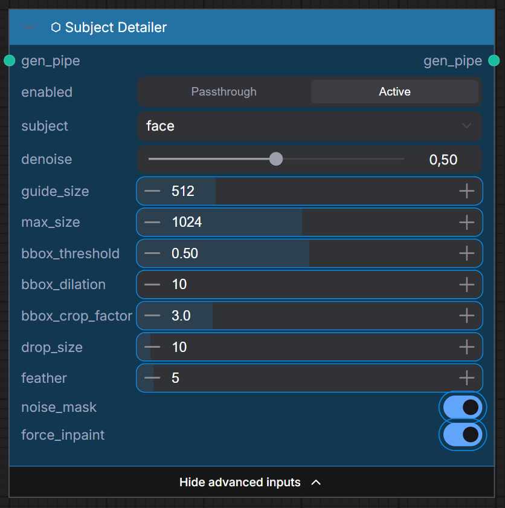

# ⬡ FaceDetailer

> Automatically detect and enhance faces in generated images. Advanced parameters are available via **Show advanced inputs**.

### Inputs

| Name | Type | Required | Advanced | Default | Description |
|------|------|----------|----------|---------|-------------|
| `gen_pipe` | `UME_PIPELINE` | ✅ | | — | Pipeline with generated image |
| `bbox_detector` | `BBOX_DETECTOR` | ✅ | ✅ | — | Detection model (from BBOX Detector Loader) |
| `denoise` | `FLOAT` | ✅ | ✅ | 0.5 | Enhancement denoising strength |
| `guide_size` | `FLOAT` | ✅ | ✅ | 384 | Target face crop size |

### Outputs

| Name | Type | Description |
|------|------|-------------|
| `gen_pipe` | `UME_PIPELINE` | Pipeline with enhanced faces |

=== "Standard Mode"
    

=== "Advanced Inputs"
    

## BBOX Detector Loader {#bbox-detector-loader}

Loads a face/body detection model for FaceDetailer.

### Inputs

| Name | Type | Required | Description |
|------|------|----------|-------------|
| `model_name` | `COMBO` | ✅ | Detection model from `models/bbox/` (e.g. `face_yolov8m.pt`) |

### Outputs

| Name | Type | Description |
|------|------|-------------|
| `bbox_detector` | `BBOX_DETECTOR` | Loaded detector for FaceDetailer |

!!! tip "Recommended detector"
    Use `face_yolov8m.pt` for face detection. Place it in `ComfyUI/models/bbox/`.
