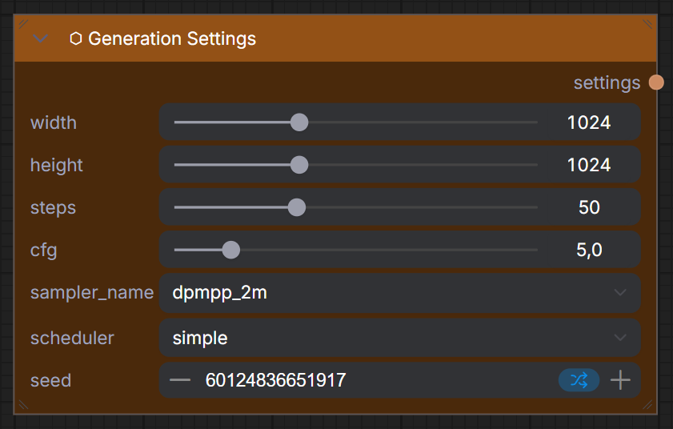

# ⬡ Generation Settings

> Configure image dimensions, sampling parameters, and random seed.

## Inputs

| Name | Type | Required | Default | Description |
|------|------|----------|---------|-------------|
| `width` | `INT` | ✅ | 1024 | Target image width (512–2048, step 64, slider) |
| `height` | `INT` | ✅ | 1024 | Target image height (512–2048, step 64, slider) |
| `steps` | `INT` | ✅ | 20 | Sampling steps (1–150, slider) |
| `cfg` | `FLOAT` | ✅ | 8.0 | CFG scale (1–30, slider). Higher = more prompt adherence |
| `sampler_name` | `COMBO` | ✅ | — | Sampling algorithm (euler, dpmpp_2m, etc.) |
| `scheduler` | `COMBO` | ✅ | — | Noise schedule (normal, karras, sgm_uniform, etc.) |
| `seed` | `INT` | ✅ | 0 | Random seed for reproducibility |

## Outputs

| Name | Type | Description |
|------|------|-------------|
| `settings` | `UME_SETTINGS` | Packed settings bundle for KSampler |

!!! tip "Recommended settings by architecture"
    | Architecture | Steps | CFG | Sampler | Scheduler |
    |-------------|-------|-----|---------|-----------|
    | SD 1.5 | 20-30 | 7.0 | dpmpp_2m | karras |
    | SDXL | 20-30 | 7.0 | dpmpp_2m | karras |
    | FLUX Dev | 20-28 | 1.0 | euler | simple |
    | Z-IMAGE Turbo | 4-8 | 1.0 | euler | sgm_uniform |

