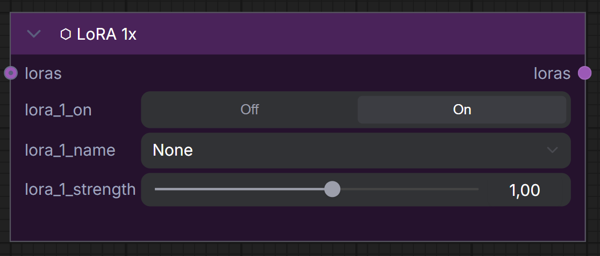
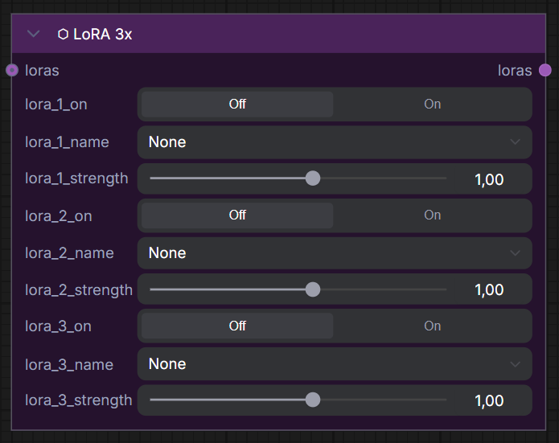
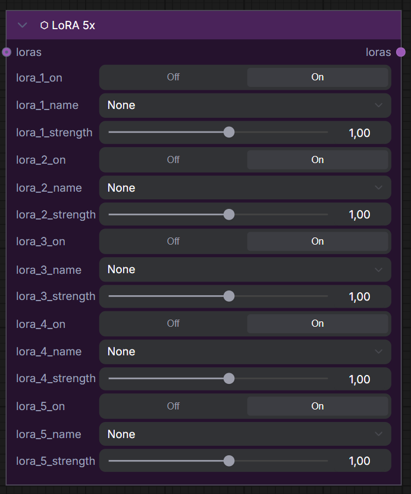
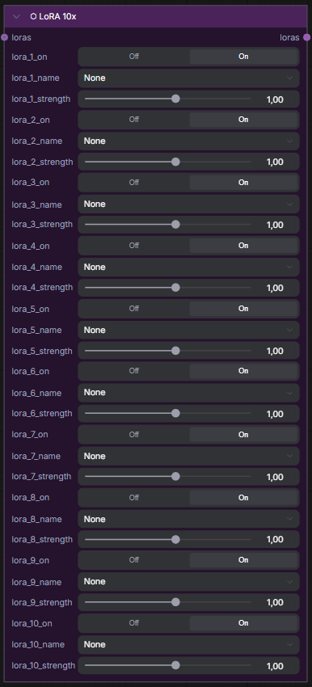

# ⬡ LoRA Blocks

> Stack LoRA models with individual on/off toggles and strength sliders.

Available in 4 slot counts: **LoRA 1x**, **LoRA 3x**, **LoRA 5x**, **LoRA 10x**.

## Inputs (per slot)

| Name | Type | Required | Default | Description |
|------|------|----------|---------|-------------|
| `loras` | `UME_LORA_STACK` | ❌ | — | Chain input from another LoRA Block |
| `lora_N_on` | `BOOLEAN` | ❌ | ON | Toggle LoRA N on/off |
| `lora_N_name` | `COMBO` | ❌ | None | Select LoRA model for slot N |
| `lora_N_strength` | `FLOAT` | ❌ | 1.0 | Strength for slot N (-10 to 10, slider) |

## Outputs

| Name | Type | Description |
|------|------|-------------|
| `loras` | `UME_LORA_STACK` | Stacked LoRA list — connect to KSampler or chain to another block |

## Chaining

LoRA Blocks can be chained together by connecting the `loras` output of one block to the `loras` input of the next:

```
LoRA 3x → LoRA 5x → KSampler
(3 LoRAs)  (5 more)   (8 total applied)
```

=== "LoRA 1x"
    

=== "LoRA 3x"
    

=== "LoRA 5x"
    

=== "LoRA 10x"
    
