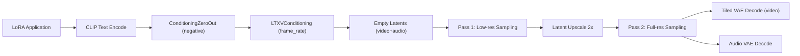

# ⬡ LTX Video Generator

> Generates LTX-2.3 video+audio using a dual-pass pipeline with ManualSigmas.

!!! info "Unified Node"
    As of v2.5, **⬡ LTX Video Generator** is an alias to the unified **⬡ Video Generator** node.
    Both WAN and LTX models are supported by the same node — the pipeline is auto-selected based on the model bundle's `loader_type`.
    Existing workflows using the LTX Video Generator node will continue to work unchanged.

## Inputs

| Name | Type | Required | Description |
|------|------|----------|-------------|
| `model_bundle` | `UME_BUNDLE` | ✅ | From LTX Loader or Bundle Auto-Loader |
| `positive` | `POSITIVE` | ✅ | Describe the scene/action for the video |
| `video_settings` | `UME_VIDEO_SETTINGS` | ✅ | From LTX Video Settings node |
| `negative` | `NEGATIVE` | ❌ | Describe what to avoid. LTX-2.3 uses ConditioningZeroOut by default |
| `loras` | `UME_LORA_STACK` | ❌ | Connect a LoRA Block node |
| `source_image` | `IMAGE` | ❌ | Source image for Image-to-Video (I2V) mode |

## Outputs

| Name | Type | Description |
|------|------|-------------|
| `video_pipe` | `UME_VIDEO_PIPELINE` | Complete video pipeline with frames + optional audio, ready for Video Output |

## Pipeline

The LTX Video Generator orchestrates the entire LTX-2.3 pipeline internally:



### Text-to-Video (T2V)
Connect only the positive prompt — no source image needed.

### Image-to-Video (I2V)
Connect a source image to condition the first frame via `LTXVImgToVideoInplace`.

### Dual-Pass vs Single-Pass
- **With upscaler**: Pass 1 at half resolution → 2x upscale → Pass 2 at full resolution (best quality)
- **Without upscaler**: Single pass at full resolution

## Audio

When `audio_enabled=True` in video settings and an Audio VAE is loaded:
- Empty audio latents are created alongside video latents
- Audio+Video latents are combined via `NestedTensor` for joint sampling
- After sampling, audio is decoded separately and muxed into the output video

## Connection to Video Output

```
⬡ LTX Loader → ⬡ LTX Video Settings → ⬡ LTX Video Generator → ⬡ Video Output
                                              ↑
                                     ⬡ Positive Prompt
                                     ⬡ LoRA Block (optional)
                                     IMAGE (optional, for I2V)
```

!!! note "CFG = 1.0"
    LTX-2.3 distilled models use `cfg=1.0` internally. The node handles this automatically.

!!! tip "VRAM Usage"
    Video decode uses spatio-temporal tiling (4 spatial tiles + temporal chunking) to keep peak VRAM low even for long, high-resolution videos.
