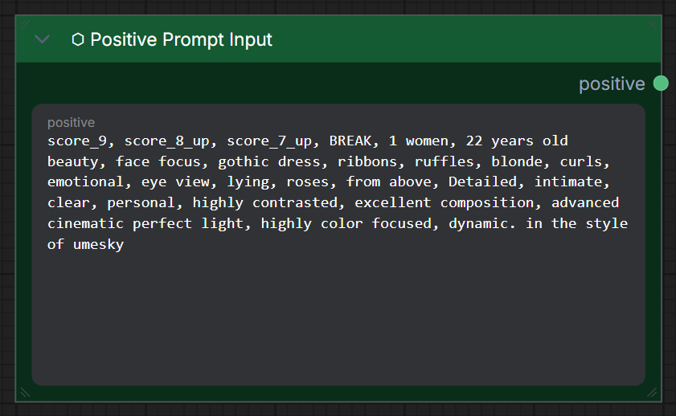
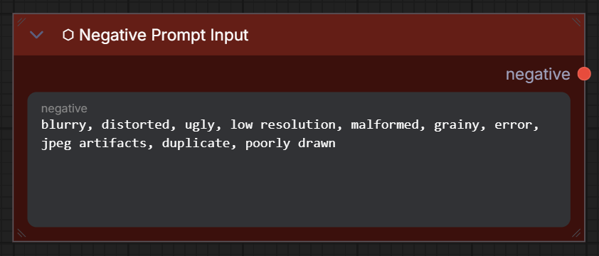

# ⬡ Prompt Inputs

> Multiline text editors for positive and negative prompts.

## Positive Prompt Input

| Name | Type | Required | Description |
|------|------|----------|-------------|
| `positive` | `STRING` | ✅ | Multiline text — what you want in the image. Supports dynamic prompts. |

**Output:** `POSITIVE` (string)

## Negative Prompt Input

| Name | Type | Required | Default | Description |
|------|------|----------|---------|-------------|
| `negative` | `STRING` | ✅ | `text, watermark` | Multiline text — what to avoid. Supports dynamic prompts. |

**Output:** `NEGATIVE` (string)

!!! note "These are simple text pass-through nodes"
    They output raw text strings. The KSampler handles CLIP encoding internally. This is different from ComfyUI's built-in `CLIPTextEncode` which outputs CONDITIONING tensors.

=== "Positive Prompt"
    

=== "Negative Prompt"
    
