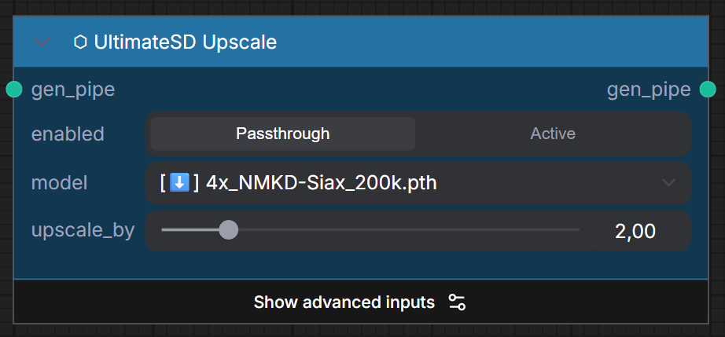
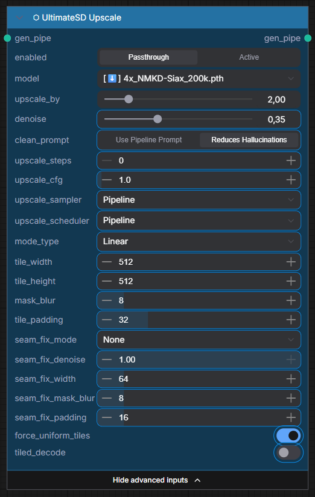

# ⬡ UltimateSD Upscale

> Tiled upscaling with redraw — upscales the generated image by processing it in overlapping tiles. Tile/denoise parameters are available via **Show advanced inputs**.

### Inputs

| Name | Type | Required | Advanced | Default | Description |
|------|------|----------|----------|---------|-------------|
| `gen_pipe` | `UME_PIPELINE` | ✅ | | — | Pipeline from KSampler with generated image |
| `enabled` | `BOOLEAN` | ✅ | | ON | Toggle upscaling on/off |
| `upscale_model_name` | `COMBO` | ✅ | | — | Upscale model (e.g. 4x-UltraSharp) |
| `upscale_by` | `FLOAT` | ✅ | ✅ | 2.0 | Scale factor |
| `tile_width` | `INT` | ✅ | ✅ | 512 | Tile width in pixels |
| `tile_height` | `INT` | ✅ | ✅ | 512 | Tile height in pixels |
| `denoise` | `FLOAT` | ✅ | ✅ | 0.2 | Redraw denoising strength |
| `seam_fix_mode` | `COMBO` | ✅ | ✅ | None | Seam fixing strategy |

### Outputs

| Name | Type | Description |
|------|------|-------------|
| `gen_pipe` | `UME_PIPELINE` | Pipeline with upscaled image |

=== "Standard Mode"
    

=== "Advanced Inputs"
    

!!! tip "When to use"
    Use UltimateSD Upscale for **traditional tiled upscaling** with model redraw. For AI-native upscaling with better coherence, try [SeedVR2 Upscale](seedvr2-upscale.md).
